# UX Flow - Астрологический бот

## Блок-схема пользовательского опыта

```mermaid
flowchart TD
    Start([Пользователь отправляет /start]) --> CheckBirthDate{Дата рождения<br/>установлена?}
    
    CheckBirthDate -->|Нет| ShowBirthWarning[Показать предупреждение:<br/>⚠️ Дата устанавливается ОДИН РАЗ<br/>Задавай вопросы только от своего лица]
    ShowBirthWarning --> WaitBirthInput[Ожидание ввода даты:<br/>ДД.ММ.ГГГГ чч:мм Город<br/>или<br/>ДД.ММ.ГГГГ чч:мм Город, КодСтраны]
    WaitBirthInput --> ValidateBirthDate{Валидация<br/>даты, времени<br/>и места}
    
    ValidateBirthDate -->|Неверный формат| ShowError[Показать ошибку:<br/>❌ Неверный формат<br/>Используй: ДД.ММ.ГГГГ чч:мм Город]
    ShowError --> WaitBirthInput
    
    ValidateBirthDate -->|Верный формат| SaveBirthDate[Сохранить дату рождения:<br/>birth_datetime = дата+время<br/>birth_place = место<br/>birth_data_set_at = NOW<br/>birth_data_can_change_until = NOW + 24h]
    SaveBirthDate --> RequestNatalChart[Запрос в астро-API<br/>для получения натальной карты]
    RequestNatalChart --> SaveNatalChart{Успешно?}
    
    SaveNatalChart -->|Ошибка| ShowNatalErrorAfterSave[Показать:<br/>✅ Данные приняты<br/>❌ Не удалось рассчитать карту]
    ShowNatalErrorAfterSave --> WaitUserQuestion
    
    SaveNatalChart -->|Успешно| SaveNatalChartDB[Сохранить натальную карту:<br/>natal_chart = данные<br/>natal_chart_fetched_at = NOW]
    SaveNatalChartDB --> ShowBirthSuccess[Показать:<br/>🎉 Готово! Натальная карта рассчитана!<br/>✅ Данные сохранены<br/>⚠️ Можно изменить в течение 24ч]
    ShowBirthSuccess --> WaitUserQuestion
    
    CheckBirthDate -->|Да| CheckNatalChart{Натальная карта<br/>есть?<br/>NatalChartFetchedAt != nil}
    
    CheckNatalChart -->|Нет| RequestNatalChartStart[Запрос в астро-API<br/>для получения натальной карты]
    RequestNatalChartStart --> SaveNatalChartStart{Успешно?}
    
    SaveNatalChartStart -->|Ошибка| ShowNatalError[Показать ошибку:<br/>❌ Не удалось рассчитать<br/>натальную карту]
    ShowNatalError --> WaitUserQuestion
    
    SaveNatalChartStart -->|Успешно| ShowReady[Показать:<br/>🐱 Привет снова!<br/>Натальная карта рассчитана,<br/>готов к работе]
    
    CheckNatalChart -->|Да| ShowReady
    
    ShowReady --> WaitUserQuestion[Ожидание вопроса<br/>от пользователя]
    
    WaitUserQuestion --> CreateRequest[Создать запрос:<br/>requests: user_id, request_text, tg_update_id<br/>status: создаётся через defer]
    
    CreateRequest --> CheckNatalChartAgain{Натальная карта<br/>есть?<br/>NatalChartFetchedAt != nil}
    
    CheckNatalChartAgain -->|Нет| RequestNatalChartOnQuestion[Запрос в астро-API<br/>для получения натальной карты]
    RequestNatalChartOnQuestion --> SaveNatalChartOnQuestion{Успешно?}
    
    SaveNatalChartOnQuestion -->|Ошибка| ShowNatalErrorOnQuestion[Показать ошибку:<br/>❌ Натальная карта не найдена<br/>Используй /start]
    ShowNatalErrorOnQuestion --> WaitUserQuestion
    
    SaveNatalChartOnQuestion -->|Успешно| GetNatalChart[Получить натальную карту<br/>из БД: GetNatalChart]
    
    CheckNatalChartAgain -->|Да| GetNatalChart
    
    GetNatalChart --> CheckChartNotEmpty{Карта<br/>не пустая?}
    
    CheckChartNotEmpty -->|Пустая| RequestNatalChartOnQuestion
    
    CheckChartNotEmpty -->|Есть| SendToKafka[Отправить в Kafka:<br/>request_id, request_text, natal_chart<br/>headers: bot_id, chat_id<br/>status: 'sent_to_rag']
    
    SendToKafka --> SendConfirmation[Отправить сообщение пользователю:<br/>✅ Запрос получен<br/>Обрабатываю...]
    
    SendConfirmation --> WaitRAGResponse[Ожидание ответа<br/>из Kafka топика responses]
    
    WaitRAGResponse --> ReceiveRAGResponse[Получить ответ из Kafka:<br/>топик: responses<br/>данные: request_id, bot_id, chat_id, response_text]
    
    ReceiveRAGResponse --> UpdateRequest[Обновить запрос в БД:<br/>requests.response = response_text]
    
    UpdateRequest --> CreateStatusSuccess[Создать статус:<br/>status = 'completed'<br/>metadata = telegram metadata]
    
    CreateStatusSuccess --> SendToUser[Отправить ответ пользователю:<br/>chat_id из Kafka сообщения<br/>status: 'sent_to_user']
    
    SendToUser --> WaitUserQuestion
    
    WaitUserQuestion -->|Команда /reset_birth_data| CheckResetTime{Можно изменить?<br/>birth_data_can_change_until > NOW?}
    
    CheckResetTime -->|Нет| ShowResetError[Показать:<br/>❌ Дата заблокирована<br/>Обратись к администратору]
    ShowResetError --> WaitUserQuestion
    
    CheckResetTime -->|Да| ShowResetWarning[Показать:<br/>⚠️ Ты уверен?<br/>Это удалит дату и натальную карту<br/>Введи 'ПОДТВЕРДИТЬ']
    ShowResetWarning --> WaitConfirm[Ожидание подтверждения]
    
    WaitConfirm -->|'ПОДТВЕРДИТЬ'| ResetBirthData[Сбросить:<br/>birth_datetime = NULL<br/>birth_place = NULL<br/>birth_data_set_at = NULL<br/>birth_data_can_change_until = NULL<br/>natal_chart_fetched_at = NULL<br/>natal_chart остаётся в БД<br/>но не используется]
    ResetBirthData --> ShowResetSuccess[Показать:<br/>✅ Дата и карта сброшены<br/>Введи новые данные]
    ShowResetSuccess --> WaitBirthInput
    
    WaitConfirm -->|Другое| WaitUserQuestion
    
    WaitUserQuestion -->|Команда /help| ShowHelp[Показать справку:<br/>/start - Начать<br/>/reset_birth_data - Сбросить дату<br/>/my_info - Моя информация]
    ShowHelp --> WaitUserQuestion
    
    WaitUserQuestion -->|Команда /my_info| ShowUserInfo[Показать:<br/>Дата рождения: birth_datetime<br/>Место рождения: birth_place<br/>Натальная карта: ✅/❌<br/>Проверяется реальное наличие<br/>в БД через GetNatalChart]
    ShowUserInfo --> WaitUserQuestion
    
    style Start fill:#90EE90
    style EndError fill:#FFB6C1
    style ShowReady fill:#87CEEB
    style SaveBirthDate fill:#FFD700
    style SaveNatalChartDB fill:#FFD700
    style SendToKafka fill:#DDA0DD
    style ReceiveRAGResponse fill:#98FB98
```

## Описание этапов

### 1. Инициализация
- Пользователь отправляет `/start`
- Проверяется наличие даты рождения

### 2. Установка даты рождения
- Если даты нет → запрос с предупреждением
- Формат ввода: `ДД.ММ.ГГГГ чч:мм Город, КодСтраны` или `ДД.ММ.ГГГГ чч:мм Город`
- Валидация формата даты, времени и места рождения
- Сохранение с ограничением на изменение (24 часа)
- После сохранения автоматически запрашивается натальная карта из астро-API

### 3. Получение натальной карты
- Проверка наличия натальной карты
- Если нет → запрос в астро-API
- Сохранение результата

### 4. Основной режим работы
- Ожидание вопросов от пользователя
- Проверка наличия натальной карты (если нет - попытка загрузить)
- Получение натальной карты из БД (lazy loading)
- Создание запроса в БД
- Отправка в Kafka топик `requests` (request_id, request_text, natal_chart, headers: bot_id, chat_id)
- Получение ответа из Kafka топика `responses`
- Обновление запроса в БД (сохранение response_text)
- Отправка ответа пользователю
- После успешной отправки в Kafka отправляется сообщение "✅ Запрос получен\nОбрабатываю..."

### 5. Дополнительные команды
- `/reset_birth_data` - сброс даты (только в течение 24 часов)
- `/help` - справка
- `/my_info` - информация о пользователе

