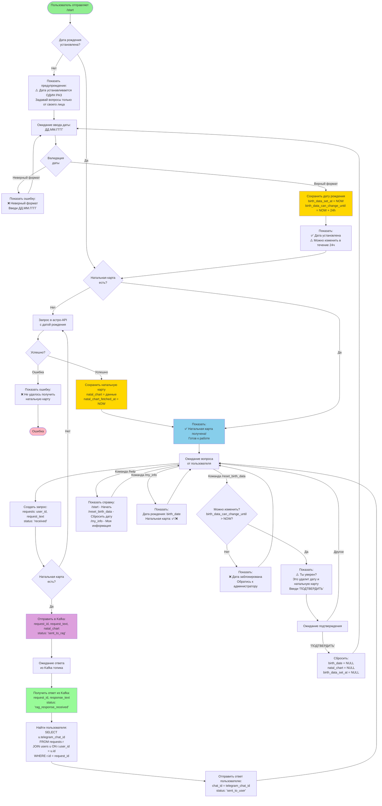

# UX Flow - Астрологический бот

## Блок-схема пользовательского опыта

## Описание этапов

### 1. Инициализация
- Пользователь отправляет `/start`
- Проверяется наличие даты рождения

### 2. Установка даты рождения
- Если даты нет → запрос с предупреждением
- Валидация формата (ДД.ММ.ГГГГ)
- Сохранение с ограничением на изменение (24 часа)

### 3. Получение натальной карты
- Проверка наличия натальной карты
- Если нет → запрос в астро-API
- Сохранение результата

### 4. Основной режим работы
- Ожидание вопросов от пользователя
- Создание запроса в БД
- Отправка в Kafka для RAG
- Получение ответа из Kafka
- Отправка ответа пользователю

### 5. Дополнительные команды
- `/reset_birth_data` - сброс даты (только в течение 24 часов)
- `/help` - справка
- `/my_info` - информация о пользователе

