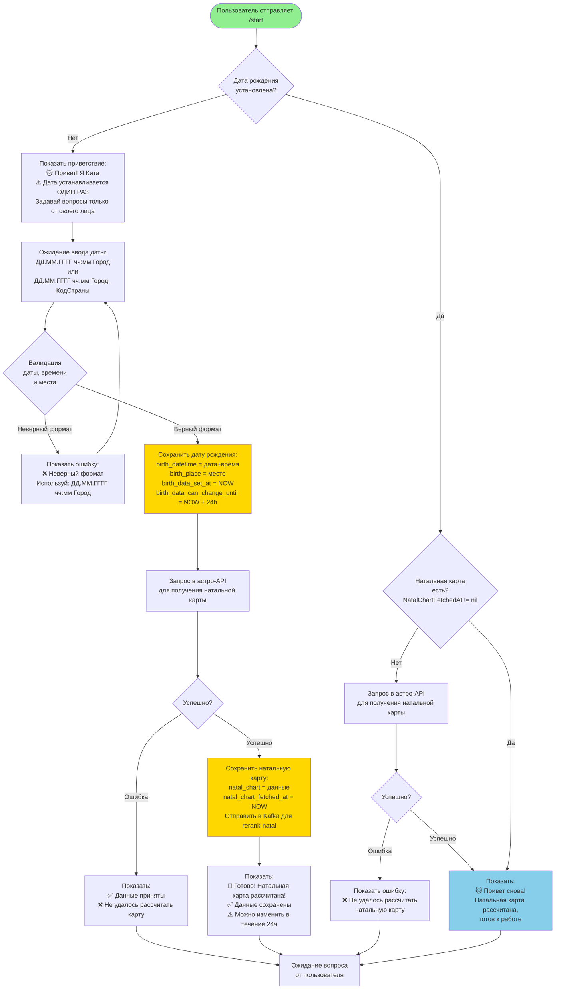
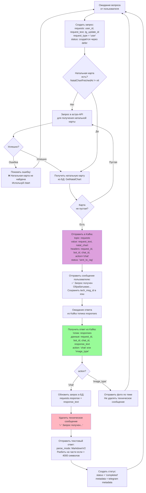
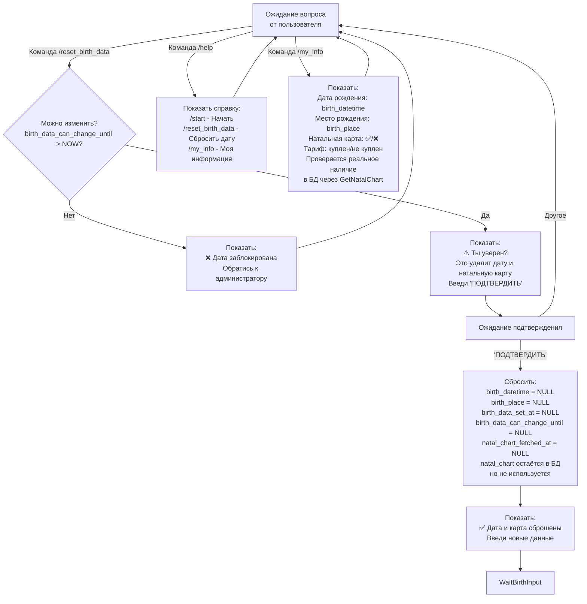

# UX Flow - Астрологический бот

## Обзор

Документ описывает пользовательский опыт взаимодействия с астрологическим ботом, включая основные сценарии использования, команды и технические детали обработки запросов.

## Основные сценарии

### 1. Первый запуск и регистрация



### 2. Обработка текстового запроса



### 3. Команды



## Детальное описание этапов

### Инициализация пользователя

**Триггер:** Пользователь отправляет `/start`

**Процесс:**
1. Проверка наличия даты рождения в БД
2. Если даты нет → показ приветствия с инструкцией по вводу
3. Если дата есть, но карты нет → автоматический запрос натальной карты
4. Если всё есть → показ приветствия для возвращающегося пользователя

### Установка даты рождения

**Формат ввода:**
- `ДД.ММ.ГГГГ чч:мм Город, КодСтраны` (например: `15.03.1990 14:30 Москва, RU`)
- `ДД.ММ.ГГГГ чч:мм Город` (например: `15.03.1990 14:30 Москва`)

**Валидация:**
- Формат даты и времени
- Дата не может быть в будущем
- Обязательно указание места рождения

**Сохранение:**
- `birth_datetime` - дата и время рождения
- `birth_place` - место рождения
- `birth_data_set_at` - время установки
- `birth_data_can_change_until` - время до которого можно изменить (NOW + 24 часа)

**После сохранения:**
- Автоматический запрос натальной карты из астро-API
- Сохранение в Redis (без TTL)
- Сохранение в БД
- **Отправка в Kafka для rerank-natal** (только при начальной регистрации):
  - topic: requests
  - headers: `action=rerank_natal`, `bot_id`, `chat_id`
  - value: `{"request_text": "", "natal_chart": <natal_report>}`

### Получение натальной карты

**Источники:**
1. Redis (кэш, без TTL) - ключ: `astro:natal:{chat_id}`
2. БД (lazy loading) - поле `natal_chart` (JSONB)

**Логика:**
- При первом сохранении даты → запрос в астро-API
- При отсутствии карты → автоматический запрос
- При пустой карте в БД → повторный запрос

**Сохранение:**
- Redis: строка (JSON)
- БД: JSONB поле `natal_chart`
- Флаг `natal_chart_fetched_at` устанавливается при успешном получении

### Обработка текстового запроса

**Тип запроса:** `RequestTypeUser`

**Процесс:**

1. **Создание запроса:**
   - Сохранение в таблицу `requests`
   - `request_type = 'user'`
   - `tg_update_id` - ID обновления из Telegram

2. **Проверка натальной карты:**
   - Если нет → попытка загрузить
   - Если пустая → повторный запрос в астро-API

3. **Отправка в Kafka:**
   - Topic: `requests`
   - Value: `{"request_text": <текст>, "natal_chart": <JSON>}`
   - Headers:
     - `request_id` - UUID запроса
     - `bot_id` - ID бота
     - `chat_id` - ID чата
     - `action` - тип действия (`chat` для текстовых запросов)

4. **Техническое сообщение:**
   - Отправка: "✅ Запрос получен\nОбрабатываю..."
   - Сохранение `tech_msg_id` в кэш для последующего удаления
   - **Удаляется только при получении текстового ответа**, не удаляется при отправке фото

5. **Обработка ответа из Kafka:**
   - Topic: `responses`
   - Два типа ответов:
     - `action='chat'` → текстовый ответ → удаление технического сообщения → отправка текста
     - `action='image_type'` → тема для фото → отправка фото → техническое сообщение остаётся

6. **Отправка ответа:**
   - Текст: MarkdownV2 форматирование, разбиение на части если > 4000 символов
   - Фото: выбор по теме и алгоритму ротации

### Типы запросов

| Тип | Описание | Требует RAG | Kafka Action |
|-----|----------|-------------|--------------|
| `user` | Обычный запрос от пользователя | ✅ | `chat` |
| `push_weekly_forecast` | Автоматический пуш: прогноз на неделю (Пн 10:00) | ✅ | `prediction` |
| `push_situational` | Автоматический пуш: ситуативное предупреждение (Ср 13:00, Вс 9:00) | ✅ | `chat` |
| `push_premium_limit` | Автоматический пуш: напоминание о платном лимите (Пт 13:00) | ❌ | - |

### Команды

#### `/start`
- Первый запуск: запрос даты рождения
- Возвращающийся пользователь: приветствие

#### `/reset_birth_data`
- Проверка возможности изменения (24 часа)
- Подтверждение через ввод "ПОДТВЕРДИТЬ"
- Сброс даты и флага натальной карты

#### `/help`
- Список доступных команд

#### `/my_info`
- Дата и место рождения
- Статус натальной карты (проверка в БД)
- Статус тарифа (платный/бесплатный)
- Количество бесплатных сообщений

## Технические детали

### Kafka сообщения

**Отправка запроса (topic: `requests`):**
```json
{
  "request_text": "текст запроса",
  "natal_chart": { /* JSON натальной карты */ }
}
```
Headers: `request_id`, `bot_id`, `chat_id`, `action`

**Получение ответа (topic: `responses`):**
```json
{
  "request_id": "uuid",
  "bot_id": "astro1",
  "chat_id": 123456789,
  "response_text": "ответ от RAG или тема для фото"
}
```
Headers: `action` (`chat` или `image_type`)

### Статусы запросов

- `sent_to_rag` (1) - запрос отправлен в Kafka
- `completed` (2) - ответ получен и отправлен пользователю
- `error` (3) - ошибка на каком-то этапе

### Этапы обработки (RequestStage)

**Фаза отправки (PhaseSend):**
- `create_request` - создание запроса в БД
- `load_natal_chart` - загрузка натальной карты
- `kafka_send` - отправка в Kafka

**Фаза приёма (PhaseReceive):**
- `get_request` - получение запроса из БД
- `save_response` - сохранение ответа в БД
- `send_telegram` - отправка сообщения в Telegram
- `get_image_usage` - получение статистики использования картинок
- `get_images` - получение картинок по теме
- `select_image` - выбор картинки по алгоритму
- `send_photo` - отправка фото в Telegram

### Техническое сообщение

**Отправка:**
- Только для текстовых запросов (`RequestTypeUser`)
- Сообщение: "✅ Запрос получен\nОбрабатываю..."
- Сохранение `tech_msg_id` в кэш с привязкой к `request_id`

**Удаление:**
- Только при получении текстового ответа (`action='chat'`)
- Не удаляется при отправке фото (`action='image_type'`)
- Атомарная операция через `TryDeleteTechMsg`

### Rerank-natal

**Триггер:** Сохранение натальной карты при начальной регистрации пользователя

**Отправка в Kafka:**
- Topic: `requests`
- Headers:
  - `action=rerank_natal` (хардкод)
  - `bot_id` - ID бота
  - `chat_id` - ID чата
- Value: `{"request_text": "", "natal_chart": <natal_report>}`

**Условие:** Флаг `rerank=true` передаётся только в `fetchAndSaveNatalChart` при начальной регистрации (ввод даты рождения), во всех остальных случаях `rerank=false`.
